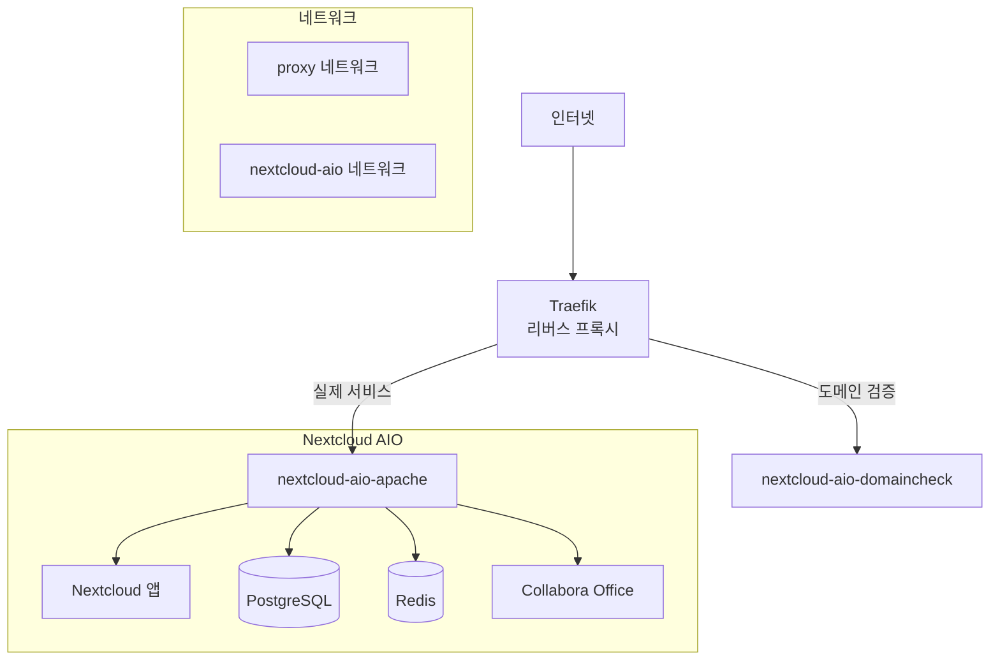

# 🌟 Nextcloud AIO + Traefik 통합 인프라

[](https://github.com/techworks-id/nextcloud_aio-traefik)
[](https://docker.com)
[](https://github.com/nextcloud/all-in-one)
[](https://traefik.io)

**Nextcloud All-in-One**과 **Traefik**을 완벽하게 통합한 개인 클라우드 인프라입니다.

## 📋 특징

- 🚀 **원클릭 배포**: 단일 명령어로 전체 스택 배포
- 🔒 **자동 SSL**: Let's Encrypt 인증서 자동 발급/갱신
- 🌐 **리버스 프록시**: Traefik으로 모든 서비스 통합 관리
- 🔄 **Failover 지원**: 도메인 검증 → 웹서버 자동 전환
- 📈 **확장 가능**: 새로운 서비스 쉽게 추가
- 🇰🇷 **한국 최적화**: KST 시간대, 한국어 가이드

## 🏗️ 아키텍처



## 📂 프로젝트 구조

```
personal-infra/
├── docker/
│   ├── .env                           # 환경변수 설정
│   ├── docker-compose-traefik.yml     # Traefik 서비스
│   ├── docker-compose-nextcloud.yml   # Nextcloud AIO
│   └── traefik/
│       ├── dynamic/
│       │   └── nextcloud.yml          # 동적 라우팅 (Failover)
│       └── logs/                      # Traefik 로그
├── scripts/
│   └── deploy.sh                      # 통합 관리 스크립트
└── README.md
```

## 🚀 빠른 시작

### 1️⃣ 환경설정

```bash
# 프로젝트 클론
git clone <your-repo>
cd personal-infra

# 환경변수 설정
cp docker/.env.example docker/.env
nano docker/.env  # 도메인, 이메일 등 설정
```

**주요 환경변수:**
```bash
# 도메인 & 이메일
NEXTCLOUD_DOMAIN=nextcloud.yourdomain.com
ACME_EMAIL=your-email@example.com

# 시간대 (한국)
TZ=Asia/Seoul

# 포트 설정
AIO_ADMIN_PORT=8081
TRAEFIK_DASHBOARD_PORT=9090
```

### 2️⃣ 초기 설정

```bash
# 네트워크 생성 및 환경 검증
./scripts/deploy.sh setup
```

### 3️⃣ 서비스 배포

```bash
# 전체 배포 (권장)
./scripts/deploy.sh deploy

# 또는 개별 서비스 시작
./scripts/deploy.sh start traefik
./scripts/deploy.sh start nextcloud
```

## 🎛️ 관리 명령어

### 기본 작업
```bash
# 상태 확인
./scripts/deploy.sh status

# 로그 확인
./scripts/deploy.sh logs traefik
./scripts/deploy.sh logs nextcloud

# 서비스 재시작
./scripts/deploy.sh restart all
```

### 고급 작업
```bash
# 개별 서비스 관리
./scripts/deploy.sh start traefik
./scripts/deploy.sh stop nextcloud

# 시스템 정리
./scripts/deploy.sh cleanup

# 사용 가능한 서비스 목록
./scripts/deploy.sh list
```

## 🌐 접속 정보

배포 완료 후 다음 주소로 접속 가능합니다:

| 서비스 | URL | 용도 |
|--------|-----|------|
| **Nextcloud** | `https://your-domain.com` | 메인 클라우드 서비스 |
| **AIO 관리자** | `http://서버IP:8081` | Nextcloud 설치/관리 |
| **Traefik Dashboard** | `http://서버IP:9090` | 프록시 상태 모니터링 |

## ⚙️ 고급 설정

### Failover 시스템
참조 리포지토리의 핵심 기능으로, 자동으로 다음과 같이 작동합니다:

1. **1차**: `nextcloud-aio-domaincheck` (도메인 검증)
2. **2차**: `nextcloud-aio-apache` (실제 웹서버)

Health Check를 통해 자동 전환됩니다.

### 보안 헤더
모든 요청에 다음 보안 헤더가 자동 적용됩니다:
- `Strict-Transport-Security`
- `X-Content-Type-Options`
- `X-Frame-Options`
- `X-XSS-Protection`
- `Referrer-Policy`

### 네트워크 구조
- **proxy**: Traefik과 모든 외부 서비스
- **nextcloud-aio**: Nextcloud 내부 컨테이너들

## 🔧 문제 해결

### 일반적인 문제들

#### 1. 도메인 접속 불가
```bash
# DNS 설정 확인
nslookup your-domain.com

# Traefik 라우터 확인
./scripts/deploy.sh logs traefik

# 네트워크 연결 확인
docker network ls
docker network inspect proxy
```

#### 2. SSL 인증서 문제
```bash
# Let's Encrypt 제한 확인
./scripts/deploy.sh logs traefik | grep -i acme

# 수동 인증서 갱신
docker compose -f docker-compose-traefik.yml restart
```

#### 3. AIO 설치 실패
```bash
# AIO 로그 확인
./scripts/deploy.sh logs nextcloud

# 도메인 검증 스킵 (필요시)
# .env에서 SKIP_DOMAIN_VALIDATION=true 설정
```

#### 4. 네트워크 문제
```bash
# 네트워크 재생성
docker network rm proxy nextcloud-aio
./scripts/deploy.sh setup
```

### 로그 위치
- **Traefik**: `docker/traefik/logs/traefik.log`
- **Docker Compose**: `./scripts/deploy.sh logs [service]`

## 📈 확장하기

### 새로운 서비스 추가

1. **docker-compose 파일 생성**: `docker-compose-yourservice.yml`
2. **deploy.sh 업데이트**:
   ```bash
   AVAILABLE_SERVICES+=("yourservice")
   COMPOSE_FILES[yourservice]="docker-compose-yourservice.yml"
   SERVICE_DESCRIPTIONS[yourservice]="Your Service Description"
   ```
3. **Traefik 라우팅 추가**: `traefik/dynamic/yourservice.yml`

### 스토리지 확장
```bash
# .env 파일에서 설정
STORAGE_ROOT=/mnt/storage
NEXTCLOUD_DATA_PATH=${STORAGE_ROOT}/nextcloud
```

## 🔄 업데이트

```bash
# 코드 업데이트
git pull

# 서비스 재배포
./scripts/deploy.sh deploy
```

## 📚 참고 자료

- [Nextcloud All-in-One 공식 문서](https://github.com/nextcloud/all-in-one)
- [Traefik 공식 문서](https://doc.traefik.io/traefik/)
- [참조 리포지토리](https://github.com/techworks-id/nextcloud_aio-traefik)

## 🤝 기여

이슈나 개선사항이 있으시면 언제든 PR을 보내주세요!

## 📄 라이센스

MIT License - 자세한 내용은 [LICENSE](LICENSE) 파일을 참조하세요.

---

<div align="center">
  <b>🌟 즐거운 클라우드 라이프를 즐기세요! 🌟</b>
</div>
